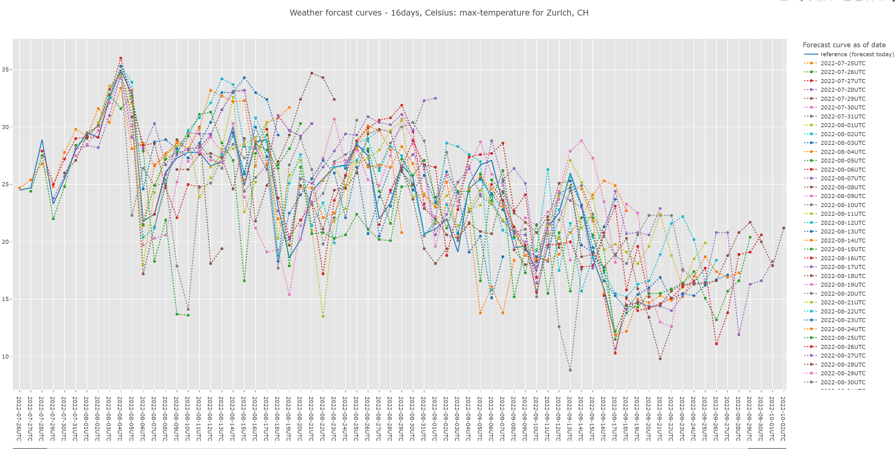
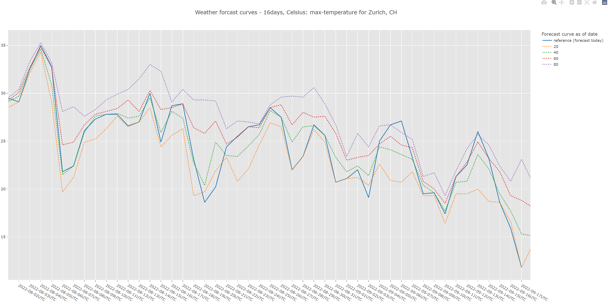

# FUN WITH PLOTS

This is <b>fun with plots</b> where we experiment with data and visualizations in rust.
For example the 

- weather data, a popular data source for forecasts and which are hard to predict and deviate the more days ahead of the reference date
- football metrics which compares stats and metrics of several players

Below are visualizations of weather data







Below are visualizations of the football data 

Ronaldo<br>
<br>
Messi<br>
<br>
Ronaldo and Messi per season (GPM - goals per minute,, scaled by 100.0; PPM - passes per minute)<br>


## Disclaimer

This is a <i>fun</i> project with many open todo's and possible improvements, i.e. due to lack of time many parts are simple and not meant for any productive setup.

The data is licensed to weatherbit.io resp. football.api-sports.io and is hence not provided here, i.e. not under source control.
For the former, you need to run the app on a daily basis for several days in order to gather the data required for creating plots similar to the ones above.

## Setup

Rename the `.env_exampe` file to `.env` and paste in your API Key from weatherbit.io resp. football.api-sports.io
Also adjust the `country` and `zip` code in the `config.toml` file for the weather data and `football_country` for the football data.

Run 
```
cargo r weather
cargo r football
```

### TODOs and ideas

    - comments
    - add more weather graphs like pressure and more football metrics and players
    - further data sources: add corona, census or stock data
    - add (mongo) DB for data management
