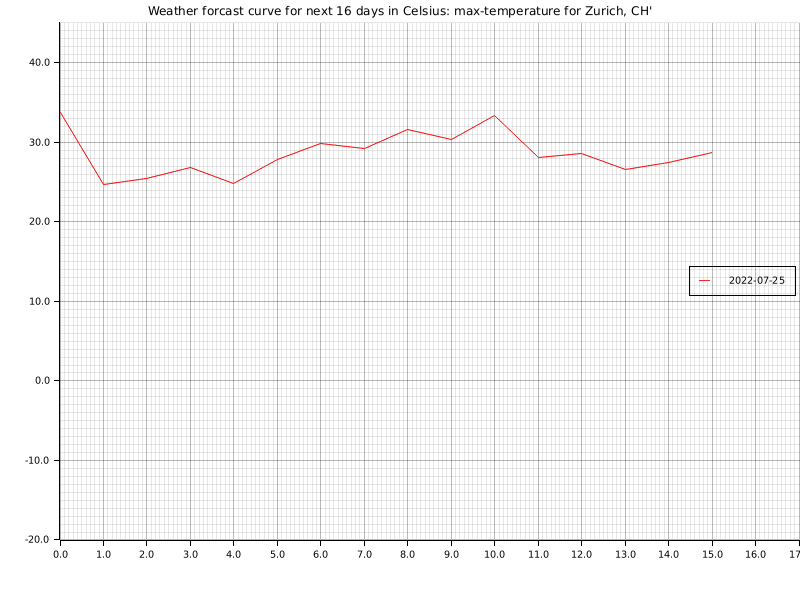
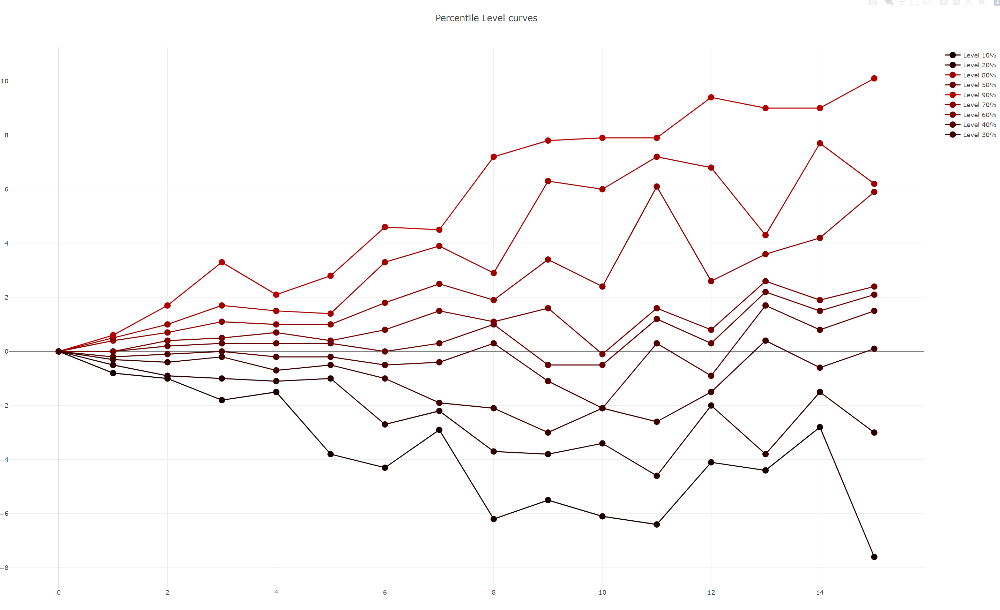

# FUN WITH PLOTS

This is <b>fun with plots</b> where we experiment with data and visualizations in rust.
For example the weather data, a popular forecast data source, which is hard to predict and deviates the more days ahead of the reference date.

Below are visualizations of weather data

## Disclaimer

This is a <i>fun</i> project with many open todo's and possible improvements, i.e. due to lack of time many parts are simple and not meant for any productive setup.

The weather data is licensed to weatherbit.io and is hence not provided here, i.e. not under source control.
You need to run the app on a daily basis for several days in oder to gather the data required for creating plots similar to the ones above.

## Setup

Rename the `.env_exampe` file to `.env` and paste in your API Key from weatherbit.io.
Also adjust the `country` and `zip` code in the `main` function. 

### TODOs and ideas

    - comments
    - show gifs and charts within Readme
    - add more weather graphs like pressure
    - maybe clap for arg parsing (once further data sources available)
    - further data sources: add corona, census or stock data
    - add (mongo) DB for data management
